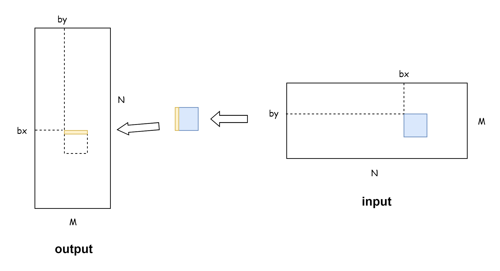

# 矩阵转置

## 如何优化**全局内存**的访问？
1. **尽量合并访问**，即连续的线程读取连续的内存，且尽量让访问的全局内存的首地址是32字节（一次数据传输处理的数据量）的倍数；
2. 如果不能同时合并读取和写入，则应该**尽量做到合并写入**，因为编译器如果能判断一个全局内存变量在核函数内是只可读的，会自动调用 `__ldg()` 读取全局内存，从而对数据进行缓存，缓解非合并访问带来的影响，但这只对读取有效，写入则没有类似的函数。另外，对于开普勒架构和麦克斯韦架构，需要**显式**的使用 `__ldg()` 函数，例如 `B[ny * N + nx] = __ldg(&A[nx * N + ny])`。

针对全局内存进行优化，差异如下：
1. device_transpose_v0：读操作是合并的，写操作是不合并的
2. device_transpose_v1：读操作是不合并的，写操作是合并的，速度提升
3. device_transpose_v2：读操作是不合并的，写操作是合并的，并显式地使用 `__ldg`，速度提升了（不清楚原因，按理说2、3性能应该保持一致）

## 如何利用**共享内存**优化矩阵转置？

<div align=center>

</div>

利用 shared_memory 优化 transpose：
1. device_transpose_v3：利用共享内存中转，读操作和写操作都是合并的，但是**存在 bank conflict**
2. device_transpose_v4：对**共享内存做padding**，解决 bank conflict
3. device_transpose_v5：使用 **swizzling** 解决 bank conflict，不需要对共享内存做 padding

## 不同kernel的运行效率
在 GTX1050，M = 12800, N = 1280, BLOCK_SIZE = 32 的情况下测试：
```
[device_transpose_v0] Average time: (6.859354) ms
[device_transpose_v1] Average time: (4.310410) ms
[device_transpose_v2] Average time: (2.117488) ms
[device_transpose_v3] Average time: (3.805533) ms
[device_transpose_v4] Average time: (2.035469) ms
[device_transpose_v5] Average time: (2.023494) ms
```

## 参考 
1. cuda编程基础与实践 (樊哲勇)
2. [CUDA笔记-内存合并访问](https://zhuanlan.zhihu.com/p/641639133)
3. [CUDA内存访问](https://zhuanlan.zhihu.com/p/632244210)
4. [CUDA:矩阵转置的GPU实现(Share Memory)](https://blog.csdn.net/m0_46197553/article/details/125646380)
5. [[CUDA 学习笔记] 矩阵转置算子优化](https://blog.csdn.net/LostUnravel/article/details/137613493)
6. [GPU的矩阵转置优化(transpose)](https://blog.csdn.net/feng__shuai/article/details/114630831)
7. [CUDA-Shared-Memory-Swizzling](https://leimao.github.io/blog/CUDA-Shared-Memory-Swizzling/#CUDA-Shared-Memory-Swizzling)
8. [关于 Bank Conflict 与 Swizzle](https://zhuanlan.zhihu.com/p/11132414477)